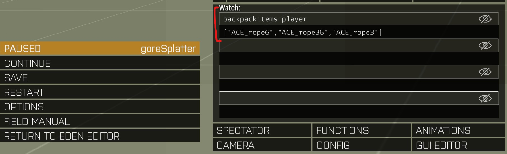

# A3U extender blank example - Extending the store

This working example demonstrates how to add new categories to the black market
dealer's stock. In this case, we add items provided by the
[CTab Blufor Tracker][workshop-url-ctab] mod; hence this addon's dependency on
it.

## Configuration

All store configuration is done with config classes. Namely, two of them:

```sqf
class A3U {
    class traderAddons {
        /* This is where you'll put:
         *
         * - dependencies: i.e.: what other mods provide the items you want
         *   added to the store
         * - a weapons stock definition (it's called "weapons" but its actually
         *   used for any kind of item to buy that can be put in an inventory).
         * - a vehicle stock definition: for vehicles to buy
         */
    };
};

class CfgHALsAddons {
    class CfgHALsStore {
        class categories {
        /* This is where you define one or more buying categories. A3U separates
         * items by their type: rifles, SMGs, launchers, etc. It's a good idea
         * to stick to this principle. You can, however, stuff everything into
         * one category, too.
         */
        };

        class stores {
        /* This is where everything comes together.
         *
         * The stores config takes dependencies from A3U (above) and the
         * categories defined.
         */
        };
    };
};
```

## Tutorial

Suppose, you want players to use the ACE towing feature. You'll need some ropes
to use the feature, but they're not available in the store by default.

### Figure out the class names

The easiest way to find out how things are _really_ called in Arma is by using
the mission editor, 3DEN.

1. Place a playable unit into an empty (VR) mission
2. Edit its inventory and add things you need class names of into the unit's
backpack
3. Run the mission
4. In the in-game debug console, see what `backpackItems player` evaluates to.
5. Those are your class names. Copy them into the clipboard.



### Set up the addon

In your extender, create a new addon. It should look like the source code you're
seeing in this example. You will need all of the files from the example (except
the images used to display this tutorial and, of course, the tutorial file 
itself) to keep everything tidy.

We'll go through them step-by-step:

File | Description
-----|------------
`$PBOPREFIX$` | This is the path prefix how Arma finds files in its virtual file system.
`CfgHalsStore.hpp` | You'll do the necessary store configuration here.
`config.cpp` | The addons "registry", if you will. Defines what the addon is called and what it depends on to correctly work.
`script_component.hpp` | An include file used basically everywhere in the mod. In this particular case, its use is limited to `config.cpp`. Defines macros used exclusively in this addon and includes other .hpp files.
`string_table.xml` | Where human readable text goes. Along with its translation into other languages.

#### Setting up `$PBOPREFIX$`

Since you're using this example extender repo as a base for your extender,
you'll already have the `main` addon's `$PBOPREFIX$` adjusted to the name of
your actual extender. All you basically have to do, is replace the _main prefix_
and the addon name itself. So, turn:

```
z\a3uebet\addons\example_store
```

into:

```
z\<my-extender-name>\addons\<my-addon-name>
```

`<my-extender-name>` should coincide with whatever `PREFIX` is set to in the
extender's main addon's `script_mod.hpp` file. The `<my-addon-name>` is what
you pick. It must be the same as this addon's directory name.

#### Setting up `CfgHalsStore.hpp`

Begin the file by `#include`'ing the necessary macros from A3U:

```sqf
#include "\x\A3A\addons\hals\Addons\store\config.hpp"
```

Add the `A3U` config class, its `traderAddons` sub-class and a forward
declaration of `addons_base`:

```sqf
#include "\x\A3A\addons\hals\Addons\store\config.hpp"

class A3U {
    class traderAddons {
        class addons_base;
    };
};
```

Declare your addon as part of the store, also declare that it can only be used
if ACE is loaded:

```sqf
#include "\x\A3A\addons\hals\Addons\store\config.hpp"

class A3U {
    class traderAddons {
        class addons_base;

        class ADDON: addons_base {
            // Declare dependency on ACE; if no dependencies, leave it empty and write {}
            addons[] = {"ace_main"};
            // This is a reference used later; leave it like that.
            weapons = QUOTE(DOUBLES(weapons,ADDON));
        };
    };
};
```

Declare that your addon's weapons have a _store_ reference by adding the
`traderWeapons` sub-class:

```sqf
#include "\x\A3A\addons\hals\Addons\store\config.hpp"

class A3U {
    class traderAddons {
        class addons_base;

        class ADDON: addons_base {
            // Declare dependency on ACE; if no dependencies, leave it empty and write {}
            addons[] = {"ace_main"};
            // This is a reference used later; leave it like that.
            weapons = QUOTE(DOUBLES(weapons,ADDON));
        };

        class traderWeapons {
            class weapons_base;
            // Referenced above as "weapons". Prefix is used for the store config itself.
            class DOUBLES(weapons,ADDON): weapons_base {
                prefix = QUOTE(DOUBLES(ADDON,stock));
            };
        };
    };
};
```

> [!NOTE]
> This concludes the Antistasi Ultimate part of the configuration. All you
> really have to pay attention to is getting the include and the dependencies
> right. Everything else is taken care of by using macros.
>
> We'll continue with the source code but for brevity's sake, well make the
> `A3U` section look as if it were code-folded.

Connect what you've done before with the store now. For this, we'll add the
`CfgHALsAddons` config class and its `CfgHALsStore` sub-class:

```sqf
#include "\x\A3A\addons\hals\Addons\store\config.hpp"

class A3U { /* ... */ };

class CfgHALsAddons {
    class CfgHALsStore {
    };
};
```

Add a category. We're selling ropes, so let's also call it that:

```sqf
#include "\x\A3A\addons\hals\Addons\store\config.hpp"

class A3U { /* ... */ };

class CfgHALsAddons {
    class CfgHALsStore {
        class categories {
            class DOUBLES(ADDON,ropes) {
            };
        };
    };
};
```

Now, populate the category with its necessary properties:

Property | Description
---------|------------
`displayName` | The name under which your category will end up in the store.
`picture` | The .paa file picture displayed next to the category in the store.

```sqf
#include "\x\A3A\addons\hals\Addons\store\config.hpp"

class A3U { /* ... */ };

class CfgHALsAddons {
    class CfgHALsStore {
        class categories {
            class DOUBLES(ADDON,ropes) {
                // The identifier "StoreRopesCategory_DisplayName" from stringtable.xml
                displayName = CSTRING(StoreRopesCategory_DisplayName);
                // Set the picture; we'll use one from Arma
    			picture = "a3\ui_f\data\gui\Rsc\RscDisplayArsenal\backpack_ca.paa";
            };
        };
    };
};
```

Next, declare the items the category holds using the `ITEM` macro. This macro
takes a class name (which we already figured out above), the item's
non-discounted price and how many of it should be available in the trader's
stock as an argument.

```sqf
#include "\x\A3A\addons\hals\Addons\store\config.hpp"

class A3U { /* ... */ };

class CfgHALsAddons {
    class CfgHALsStore {
        class categories {
            class DOUBLES(ADDON,ropes) {
                // The identifier "StoreRopesCategory_DisplayName" from stringtable.xml
                displayName = CSTRING(StoreRopesCategory_DisplayName);
                // Set the picture; we'll use one from Arma
    			picture = "a3\ui_f\data\gui\Rsc\RscDisplayArsenal\backpack_ca.paa";

                // 3m rope for 10 bucks, have 100 on stock
                ITEM(ACE_rope3,10,100)
                // 6m rope for 20 bucks, have 50 on stock
                ITEM(ACE_rope6,20,50)
                // 36m rope for 120 bucks, have 10 on stock
                ITEM(ACE_rope36,120,10)
            };
        };
    };
};
```

> [!NOTE]
> Note the distinct lack of a trailing semicolon `;` after each `ITEM` line.
> Sadly, that's supposed to be that way.

Finally, we'll tie it all together and tell the store about your... store and
what its categories are. We'll pseudo-code-fold the `categories` portion, again,
for brevity, too.

```sqf
#include "\x\A3A\addons\hals\Addons\store\config.hpp"

class A3U { /* ... */ };

class CfgHALsAddons {
    class CfgHALsStore {
        class categories { /* ... */ };

        class stores {
            // Just what "prefix" above was defined as
            class DOUBLES(ADDON,stock) {
                // This stays.
                displayName = "$STR_ARMS_DEALER_STORE";
                // List all stores we've defined above. Since there's only one,
                // we only list the one we defined.
                categories[] = {
                    QUOTE(DOUBLES(ADDON,ropes))
                };
            };
        };
    };
};
```

[workshop-url-ctab]: https://steamcommunity.com/sharedfiles/filedetails/?id=1643720957
