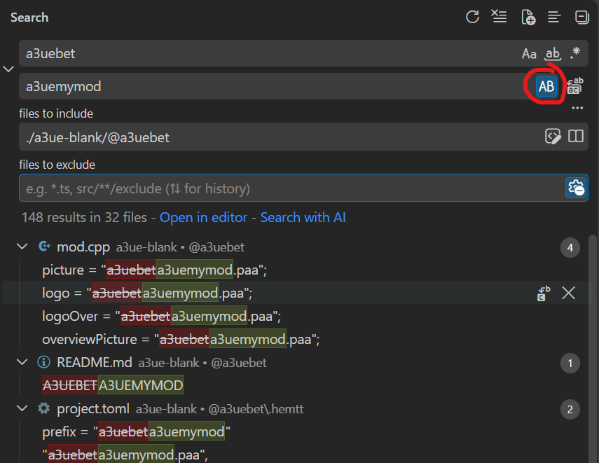

A3UEBET
-------

**Antistasi Ultimate Blank Extender Template**

This is a revised example of how you build your own extender fast.

It is a working demonstration of how extenders to Antistasi Ultimate can be
built but we consider it a work-in-progress nonetheless. If you need help or are
missing an example case we haven't considered, yet, use our [Discord][url-discord-a3u].

## Requirements ##

* [HEMTT][url-hemtt-dev] - an opinionated Arma 3 build tool
* [Antistasi Ultimate Mod][url-steam-workshop-a3u]
* [Advanced Developer Tools][url-steam-workshop-adt] (optional)
* [Zeus Enhanced][url-steam-workshop-zen] (optional)
* [Visual Studio Code][url-vscode] (optional; use an editor of your chosing,
  but this author recommends VSCode)

## Examples included ##

We aim to constantly increase examples for APIs we provide for extender authors.

As of now, the "blank" template's mod exists of the following addons:

### Factions ###

The `example_faction` addon of the mod demonstrates how to bring your own
factions to life.

### Black market store ###

The `example_store` addon of this mod demonstrates how to set up a store
category and add items to its inventory.

### Rebel buy menu ###

The `example_utility_items` addon of this mod demonstrates how to add stuff
to the rebel buy menu's "OTHER" section.

## Getting started ##

1. Install the above [requirements](#requirements).
2. Clone this repository to a location of your chosing
3. Copy the `@a3uebet` folder somewhere
4. Think of a so-called _prefix_ for your extender; shouldn't be too long
5. Rename the copy to what your extender should be called
6. A LOT of search/replace (faster in VSCode with search/replace in files).

   Look for the current prefix (which is a3uebet) and rename to _your_ prefix (_a3uemymod_ in this example):
   
7. Open a command line (or terminal in VSCode) and run your first `hemtt check` (<-- this is your new best friend).
8. You're ready to go

## Testing your extender ##

Once you added stuff - or just want to test out this example extender - simply
run `hemtt launch`.

This will start your extender with CBA & Antistasi Ultimate loaded. In the main
menu, host a local game, select an Antistasi map of your chosing and launch.

Any time you add stuff to your extender, quit Arma and repeat. HEMTT will build
your extender fresh and load it into Arma.

## Releasing your extender ##

Use the `hemtt release` command. It will place `a3uemymod-1.0.0.0.zip` in a
`releases` folder in your mod folder. Version number can be adjusted by editing
`addons\main\script_version.hpp`.

Either unpack the ZIP somewhere, or point Arma Tools' Publisher tool to 
`<your-mod-directory>\.hemttout\release` to upload the extender.

[url-discord-a3u]: https://discord.gg/antistasiultimate
[url-hemtt-dev]: https://hemtt.dev
[url-steam-workshop-a3u]: https://steamcommunity.com/sharedfiles/filedetails/?id=3020755032
[url-steam-workshop-adt]: https://steamcommunity.com/sharedfiles/filedetails/?id=3499977893
[url-steam-workshop-zen]: https://steamcommunity.com/sharedfiles/filedetails/?id=1779063631
[url-vscode]: https://code.visualstudio.com/
